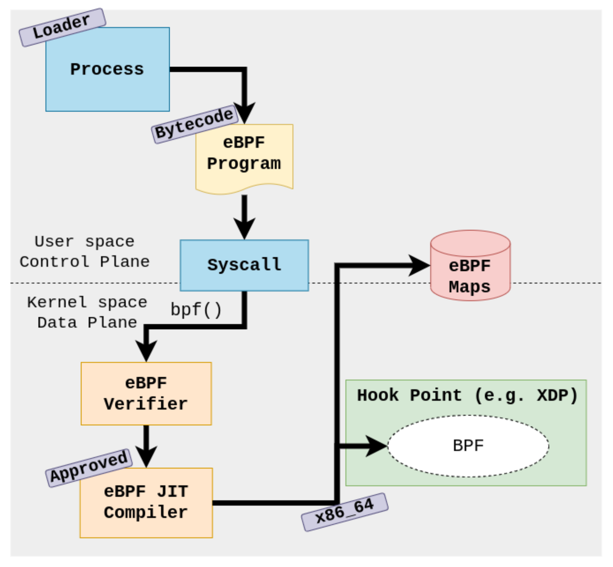
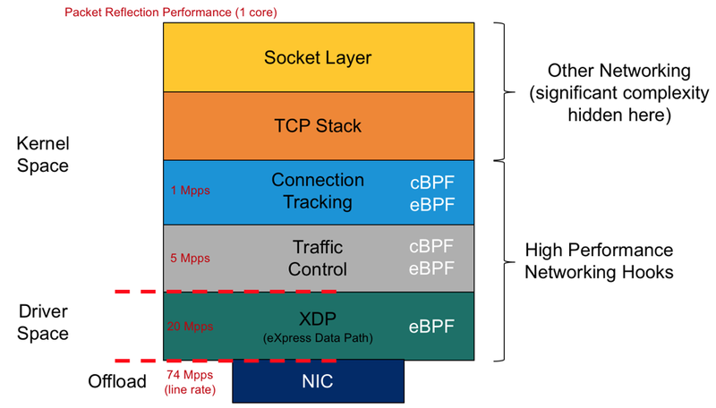

# IP-Blocker
**An IP blocker, also known as an IP filtering or IP firewall tool**

**XDP (eXpress Data Path) is a technology in the Linux kernel that allows for high-performance packet processing at the early stages of packet reception**

**What is XDP**

XDP stands for eXpress Data Path, and provides a high performance data path in the Linux kernel for processing network packets as they hit the NIC. Essentially, you can attach XDP programs to a network interface, and then those programs get callbacks every time a new packet is seen on that interface. 

With XDP, you can perform packet filtering and modification directly within the kernel before the packets are passed up the networking stack.

To drop a packet using XDP, you need to attach an XDP program to the desired network interface and implement the logic to drop unwanted packets within
that program.

To implement XDP drop with dynamic policy,typically need to do the following:
  Load Dynamic Policy: Implement a mechanism to load dynamic policy rules into the kernel. The dynamic policy rules define the criteria for dropping or    accepting packets based on various attributes, such as source/destination IP addresses, port numbers, or protocol types. The policy rules can be
  updated and changed without modifying the kernel code.

  Attach XDP Program: Write an XDP program that evaluates the packet against the loaded dynamic policy rules and decides whether to drop or accept the     packet. The XDP program will be attached to specific network interfaces to process incoming packets on those interfaces.

  Packet Evaluation: Inside the XDP program, evaluate the incoming packet against the dynamic policy rules. If the packet matches any of the rules that   require dropping, you can use the XDP XDP_DROP action to drop the packet immediately.

  Perf Event and BPF Maps (Optional): Optionally, you can use BPF maps and perf events to communicate between user-space and kernel-space to dynamically   update the policy rules. This allows you to change the policy rules on-the-fly without unloading and reloading the XDP program.

**The hooks** - Where do the packets get classified/drop?
The amount of hooks for eBPF is proliferating due to its flexibility and usefulness. However, we will focus on those at the lower end of the datapath. The key difference here being that eBPF adds an additional hook in driver space. 

This hook is called eXpress DataPath, or XDP. This allows users to drop, reflect or redirect packets before they have an skb (socket buffer) metadata structure added to the packet. This leads to a performance improvement of about 4-5X.
  

**Dynamic Policy**

In the context of system administration and network security, dynamic policy refers to the ability to modify security rules, access controls, or configurations on-the-fly without requiring a system restart or manual intervention. Dynamic policies allow administrators to adapt and update security rules in real-time based on changing network conditions, threat landscapes, or business requirements. This flexibility enables organizations to respond quickly to security incidents, apply updates, or adjust access controls without interrupting critical services.

**Notifier: In software development, a notifier is a component or mechanism that sends notifications or events to other parts of the system when certain conditions are met**

Notifiers are commonly used in event-driven programming and are responsible for alerting relevant components when specific events occur.
In the XDP-IPBlocker will receive the IP address,whenever the Policy file gets an update of an IP address and immediatly send the IP to Userspace code ,and after convert the IP address into specific formate it will finally inject into eBPF program ,while eBPF code is already in running state.
eBPF Kernel program will finally block that IP ,before they reach the networking stack.

**Architecture and Code Documentation**
[Documentation](.././IP-Blocker/documentation/code-documentation.md)

# tarian-defenders
