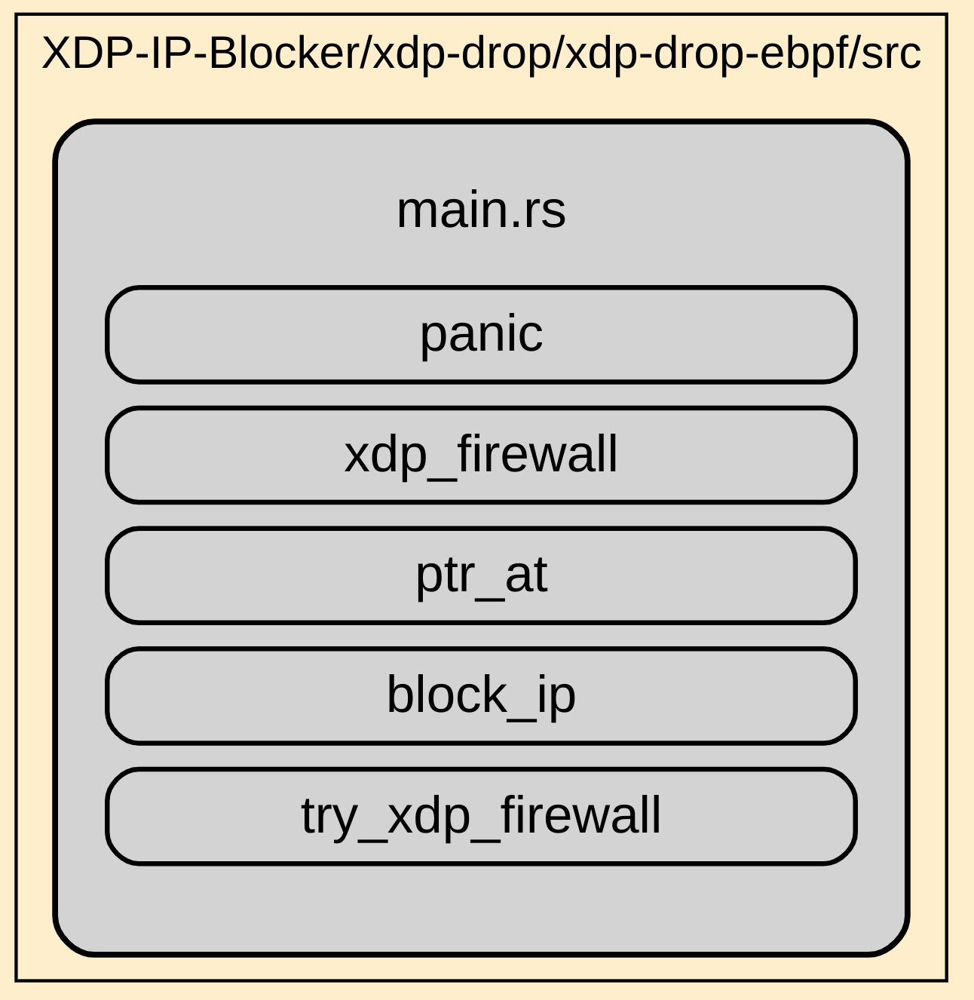
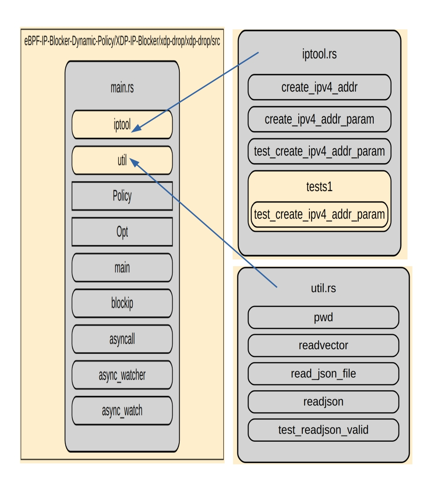

**IP-Blocker**

This Project Contains 6 
folders 

1)xdp-drop root folder contain 3 subfolder.

    1.1)xdp-drop  (userspace code)

[xdp-drop](../xdp-drop/xdp-drop/src/main.rs)

    1.2)xdp-drop-common (common library)

[xdp-drop-common](../xdp-drop/xdp-drop-common/src/lib.rs)

    1.3)xdp-drop-eBPF(eBPF kernel code to block IP)

 [xdp-drop-eBPF](../xdp-drop/xdp-drop-ebpf/src/main.rs)

2)Policy

(folder contaning Policy/output.json file which is generated by gRPC server and received by client)

[Policy File](../Policy/output.json)

3)grpc-stream 
(containing two folder server and client)

[grpc](../grpc-stream/)

4)doc

(containg documentaion in html formate)

5)documentation

(documentation in markdown and link)
[documentation](../documentation/code-documentation.md)

6)Test(Test Result)

 [Test Result](../xdp-drop/testresult.txt)

[Test Script](../Test/ping_ips.py)

**IPBlocker is combination of eBPF and User space code**
comprise three seperate component 

1) User-Space code to receive P address from Policy.json 
    in evey updates and inject that IP to eBPF Kernel Code.
2) Kernel code eBPF to receive IP address and drop every packet from 
that IP.

3) gRPC-streaming, where the server sends the IP address to the client, which then creates a Policy.json file.

**The user space code is running in user space and connect to eBPF Kernel code.
user space code is  continualy monitor , Policy.json file which stored ip address comming from server(gRPC server) and recieved by client(gRPC client)**

User Space Code 
In user space contains 3 module.
1)main.rs.

2)iptool.rs.

3)util.rs.

**main.rs** is the entry point of the user space code.
 This main module load eBPF object file as raw bytes .
 in subsequent it will call fn asyncall() to detect any events read ,write ,delete and notify in Policy.json file.
 Policy.json file is generated by gRPC client after receving IP address from gRPC server.
 
 It calls two submodules, iptool.rs and util.rs.

**iptool.rs** is responsible to parse the json strings and then convert them into eBPF-enabled IP address format.

**util.rs** is responsible for reading an external JSON file, filtering its content, and extracting IPs from it. The extracted IP data is returned as JSON data, which is then passed to iptool.rs/create_ipv4 function to convert them into the eBPF IP format. These converted IP addresses are then injected into the eBPF code to add them to the BLOCKLIST.

**The eBPF code is responsible for blocking the IP addresses added to the BLOCKLIST.**

User Space code notifies immediately on each update and fetching the IP address into kernel space.

