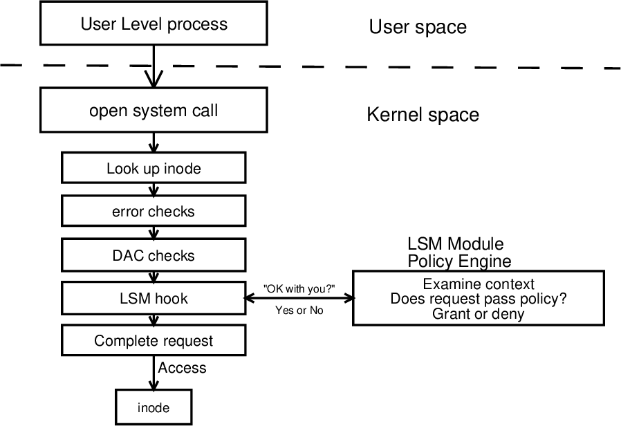
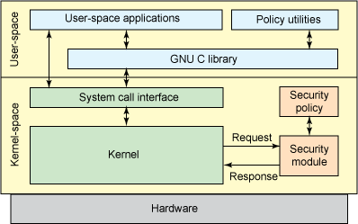
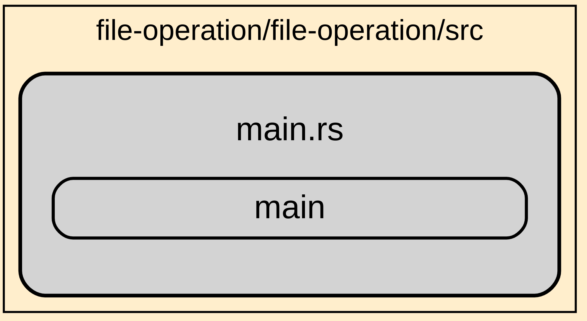

# file-operation

## Linux Security Modules (LSM) 

LSM is a framework within the Linux kernel that allows the implementation of various security modules. LSM enables additional security controls and policies to be enforced on Linux systems, making it a crucial component for system security.

File operations are one of the areas where LSM can be used to enforce access control and other security policies. The LSM hooks into various file-related processes to perform security checks and make access decisions based on defined security policies.

**LSM High Level View**

At the Policy level a user space application can dynamically update the policy and inject that policy into the kernel at runtime.

In this current `file operation` program, LSM hook file open is implemented to audit specific file systems, watch every event under that file system and restrict them based on a precondition.

Currently the program is working statically which restricts the file system with preconditions, hardcoded in the code. 

In this program only `mkdir` command is restricted under `usr/bin` file system.

Some of the file-related operations that LSM can intercept and control include:

1. **File Read/Write Operations**: LSM can control read and write access to files, ensuring that only authorized processes or users can read or modify specific files.

2. **File Creation and Deletion**: LSM can enforce rules on file creation and deletion, allowing or denying specific processes or users from creating or removing files in certain directories.

3. **File Permissions**: LSM can enforce file permissions by checking the access permissions and ownership of files.

4. **File Attribute Operations**: Operations like setting extended file attributes or changing file metadata can also be controlled by LSM.

5. **File Executions**: LSM can control the execution of binary executables, ensuring that only authorized processes can execute certain programs.

The LSM framework provides hooks into these file operations, and individual security modules can implement their policies and access control mechanisms. Common Linux security modules like SELinux (Security-Enhanced Linux) and AppArmor use the LSM framework to enforce mandatory access control (MAC) policies on file operations.

By using LSM, Linux administrators and security professionals can implement fine-grained security policies to protect sensitive files, control access to critical resources, and mitigate security risks effectively. The LSM framework is extensible, allowing new security modules to be developed and integrated into the Linux kernel as needed.

**This repository contained 6 folder**

`file-operation` 

User Space Code contained main.rs ,entry point of the program to load and run kernel space code file-operation-ebpf.

[file-operation](./file-operation/src/main.rs)

`file-operation-common`

Common library for both user and kernel code

[file-operation-common](./file-operation-common/src/lib.rs)

`file-operation-ebpf`

File Operation eBPF is kernel Space code, auditing all the file system access by each Operation System process and restrict them when specific condion meet. 

[file-operation-ebpf](./file-operation-ebpf/src/main.rs)

`xtask`

contained utility to compile and build eBPF code

[xtask](./xtask/)

`Code-Documentation`

(Contained images)

`target`

 contained executable file
 
 [target](./target/)

# Run 
[Run](./Run.md)

