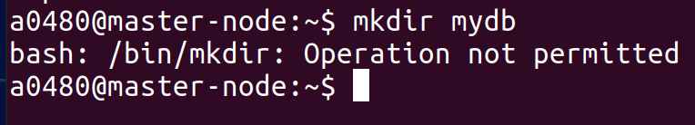

**To run LSM file-operation**

Switch to console under root directory 
In console 1..

```
file-operation$
```
Confirm the directory structure.
```
file-operation$ ls
Cargo.lock  Code-Documentation  file-operation-common  README.md  target
Cargo.toml  file-operation      file-operation-ebpf    Run.md     xtask
```
**Run the file**

```
file-operation$ sudo -E RUST_LOG=debug target/release/file-operation
```
**Now Open new console under home directory**

In console 2..

Trying to run `mkdir` command under  the home directory and see the out put.


Output is a system generated error message that mkdir command is not permitted under ``"/usr/bin/"`` file system.

**Now to go console 1 and stop the running program by `ctrl + c` which is running by command**

`
 sudo -E RUST_LOG=debug target/release/file-operation
`